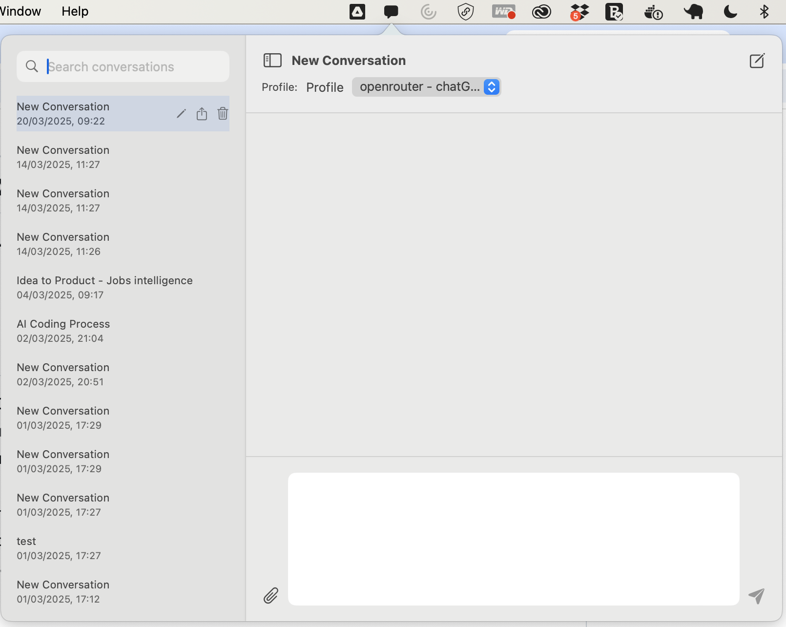

# MacOS AI Chat App

A native macOS application that serves as a GUI chat frontend for OpenAI-compatible models, including local models running on Ollama.



## Features

- **Native macOS UI** with a clean, ChatGPT-style interface
- **Multi-turn conversation support** with persistent context
- **Searchable conversation history** stored locally
- **Document handling** - drag and drop PDFs and TXT files to include their content in prompts
- **Profile management** - create and switch between different model configurations
- **Menu bar integration** - quick access from the macOS menu bar
- **Dark mode support** - follows macOS system theme

## Requirements

- macOS 13.0 or later
- Xcode 15.0 or later (for development)
- Swift 5.9 or later (for development)

## Installation

### Option 1: Download the Release

1. Go to the [Releases](https://github.com/yourusername/macoschatapp/releases) page
2. Download the latest `.dmg` file
3. Open the DMG and drag the app to your Applications folder

### Option 2: Build from Source

1. Clone the repository:
   ```bash
   git clone https://github.com/yourusername/macoschatapp.git
   cd macoschatapp
   ```

2. Open the project in Xcode:
   ```bash
   open MacOSChatApp.xcodeproj
   ```

3. Build the project (⌘B) and run (⌘R)

Alternatively, you can use the provided build script:
```bash
./build_app.sh
```

## Usage

### Setting Up API Access

1. Launch the app
2. Click on the menu bar icon to open the chat window
3. Open Settings
4. Create a new profile with your API key and endpoint
   - For OpenAI: Use `https://api.openai.com/v1/chat/completions` as the endpoint
   - For Ollama: Use `http://localhost:11434` as the endpoint

### Chatting

1. Type your message in the input field
2. Press Enter or click the send button
3. View the AI's response in the chat window

### Document Handling

1. Drag and drop a PDF or TXT file into the chat window
2. Edit the extracted text if needed
3. Send the content to the AI

### Managing Conversations

1. Use the sidebar to view past conversations
2. Search for specific conversations
3. Create a new conversation with the "+" button
4. Export conversations as text, markdown, or PDF

## Project Structure

- **App**: Main application entry point
- **UI**: User interface components
  - **Views**: Main views (ChatView, SettingsView, etc.)
  - **Components**: Reusable UI components
  - **ViewModels**: View models for the MVVM architecture
  - **Managers**: UI-related managers (MenuBarManager, etc.)
- **Data**: Data handling and persistence
  - **Models**: Data models
  - **Managers**: Data managers (DatabaseManager, KeychainManager, etc.)
  - **Services**: Services for API communication and document handling

## Contributing

Please see [CONTRIBUTING.md](CONTRIBUTING.md) for details on how to contribute to this project.

## License

This project is licensed under the MIT License - see the [LICENSE](LICENSE) file for details.

## Acknowledgments

- [SwiftUI](https://developer.apple.com/xcode/swiftui/) - UI framework
- [SQLite.swift](https://github.com/stephencelis/SQLite.swift) - SQLite database interface
- [KeychainAccess](https://github.com/kishikawakatsumi/KeychainAccess) - Keychain wrapper
- [Alamofire](https://github.com/Alamofire/Alamofire) - HTTP networking
- [SwiftyJSON](https://github.com/SwiftyJSON/SwiftyJSON) - JSON parsing
